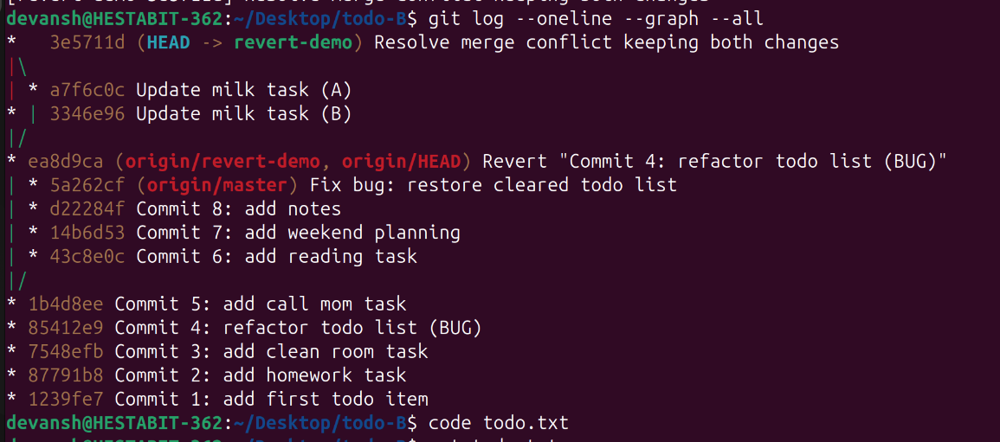

# Merge Conflict Postmortem

## What happened
Two separate clones of the same Git repository modified the same line in the file `todo.txt`. These changes were made independently on different branches. When an attempt was made to merge the branches, Git detected overlapping modifications and stopped the merge process.

## Why conflict occurred
Git merges changes by comparing files line-by-line. Since both branches introduced different changes to the exact same line, Git was unable to determine which change should take priority. Automatic merging is not possible in such cases, and manual intervention is required to resolve the conflict safely.

## Resolution
The conflicted file was reviewed manually to understand the intent of both changes. The file was then edited to preserve both updates in a meaningful way. After removing the conflict markers, the file was staged and the merge was successfully completed with a commit.

## Evidence

